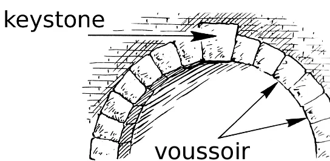

## **CI 소개 (60)**

Build -> Test -> Merge

마틴 파울러의 "Continuous Integration" 글에서 CI 정의

- 소프트웨어 개발 팀이 코드 변경사항을 공유 리포지토리에 자주 통합한다.
- 통합은 하루에 여러 번 발생 가능하다.
- 각 통합은 자동화된 빌드를 통해 검증한다.
- 목표
    - 소프트웨어 품질 향상
    - 신속한 피드백을 통한 문제 조기 발견 및 해결
    - 개발 프로세스 투명성 증가
    - 팀 협업 촉진

사람들이 자주 혼동하는 것은 CI와 자동화된 빌드/테스트를 동일시 하는 것이다. CI는 자동화된 빌드와 테스트를 포함하지만, 이것만으로 CI가 완성되는 것은 아니다. CI의 핵심은 개발자들이 자신의 작업을 주기적으로 메인 라인에 통합하고, 이 통합이 자주 일어나며, 각 통합이 자동화된 빌드와 테스트를 통해 검증되어야 한다는 것이다.

CI의 주요 목적은 통합 과정에서 발생할 수 있는 문제를 조기에 발견하고 해결하여, 소프트웨어의 품질을 유지하고 개선하는 것이다. 따라서, 단순히 자동화된 빌드와 테스트를 구축하는 것을 넘어, 개발 프로세스와 팀 문화에 CI의 원칙을 내재화하는 것이 중요하다. CI는 기술적인 접근 방법과 함께, 팀이 코드를 얼마나 자주 통합하고, 문제를 어떻게 해결하는지에 대한 방법론적인 측면도 포함한다.

### Put everything in a version controlled mainline 원칙

소프트웨어 팀이 소스 코드를 버전 제어 시스템에 보관해야 하며, 이를 통해 개발자가 제품의 현재 상태뿐만 아니라 변경된 모든 내용을 쉽게 찾을 수 있어야 한다는 원칙

1. 모든 코드 변경사항을 버전 제어 시스템의 메인라인에 정기적으로 통합해야 한다.

   repository should reliably return product source code, tests, database schema, test data, configuration files, IDE configurations, install scripts, third-party libraries, and any tools required to build the software.

   하지만 이는 모든 것을 저장해야 하는 것이 아닌, <작년의 제품 소스를 체크아웃 한다면 지금 사용하는 버전이 아니라 작년에 사용했던 환경으로 빌드할 수 있어야 한다> 를 만족시키기 위한 것이다.

2. 특정 작업의 코드를 쉽게 찾을 수 있어야 한다.

   가능하면 텍스트를 이용해 제품과 환경을 정의해야 한다. 이는 버전 간의 차이를 쉽게 확인하기 위함이다.

   CI는 제품의 현재 상태 역할을 하는 하나의 공유 브랜치, 즉 명확한 Mainline을 확보하는 데 의존하기 때문에 특정 코드를 쉽게 찾을 수 있도록 명확한 이름과 URL체계가 필요하다.

### **Automate the Build**

누구나 새로운 환경에 소스를 체크아웃하고 단일 명령으로 실행 시스템을 가질 수 있어야 한다.

사람이 명령어를 입력하거나 클릭을 하는 것은 시간 낭비이자 휴먼에러의 원인이 된다. 따라서 자동화 되어야 한다.

### **Make the Build Self-Testing**

버그가 production에 포함되면 수정하는 것이 어려워지므로 자동화된 테스팅으로 빠르게 잡아내야 한다.

이를 위한 Test suite 가 중요하다. 이것이 곧 CI에 TDD가 필수라는 의미는 아니지만, 대부분의 경우 자테 테스트 코드를 가지는 것은 좋은 방법이다.

하지만 테스트가 모든 것을 찾을 수 있는 것은 아니며, 완벽한 테스트가 목표가 아니다. 자주 실행되는 불완전한 테스트가 전혀 작성되지 않은 완벽한 테스트보다 훨씬 낫다.

### **Everyone Pushes Commits To the Mainline Every Day**

문제를 빠르게 해결하기 위한 핵심은 빠르게 찾는 것이다. 여러 개발자 간의 충돌이 있는지 빠르게 알 수 있으며, 시간이 적게 지날수록 해결하기 쉽다.

### **Every Push to Mainline Should Trigger a Build**

팀의 모든 구성원이 최소한 매일 한 번씩 통합한다면, 원칙적으로 메인라인은 건강한 상태를 유지해야 한다. 하지만 실제로는 여전히 문제가 발생할 수 있다. 이는 푸시 전에 업데이트하고 빌드하는 것을 누락하는 등의 규율 부족이나, 개발자 작업 공간 간의 환경 차이 때문일 수 있다.

따라서 모든 커밋이 메인라인에 통합되기 전에 검증되도록 해야 한다. 여기에서 Jenkins와 같은 CI서비스를 활용하며, 메인라인이 커밋을 받을 때마다 통합하여 성공적으로 완료가 되었는지 알려야 한다. 실패가 발생하면 최신 Push에서 문제가 발생한 것을 알 수 있어 문제 범위를 좁혀나갈 수 있다.

### **Fix Broken Builds Immediately**

CI는 메인라인이 정상적일때만 작동할 수 있다. 통합 빌드에 실패하면 즉시 수정해야 한다.

빌드를 수정하기 위한 가장 간단한방법은 최신 커밋을 되돌리는 것이다.

또는 Pending Head라고도 하는 사전 테스트된 Gated Commit을 사용하여 메인라인이 깨지는 모든 위험을 사전에 제거하는 방법도 있다.

### **Keep the Build Fast**

“신속한 피드백을 제공하는 것”: 긴 시간이 걸리는 빌드만큼 효율과 생산성을 떨어뜨리는 일은 없다.

이를 위해 클라우드 환경을 활용해 빌드 클러스터를 쉽게 구성할 수 있다.

### **Hide Work-in-Progress**

CI는 작업에 약간의 진전이 있을 경우 빌드가 문제없을 때 즉시 통합을 의미하는데, 이는 사용자가 인식할 수 있는 기능이 완전히 형성되기 이전에 통합을 하는 것을 의미함. 따라서 Live Release에 존재하는 미완성 기능의 일부인 잠복된 코드latent code를 어떻게 처리할지 고려해야 한다.

Production에서 실행되지 않도록 KeyStone Interface를 사용해 신규기능을 활성화 하는 것을 마지막에 추가함으로써 코드 실행을 방지할 수 있다.

키스톤이 적용되지 않는 경우에는 환경변수와 같은 것으로 feature flag를 이용하는 방법이 있다. 테스트는 수행하되 Production에서 feature flag를 확인하여 on/off를 제어할 수 있다.

### **Test in a Clone of the Production Environment**

테스팅의 주된 목적은 생산 환경에서 발생할 수 있는 시스템의 모든 문제를 통제된 조건 하에서 밝혀내는 것이다.

테스트를 다른 환경에서 수행하는 경우 테스트와 생산 환경 사이의 모든 차이점으로 인해 위험이 발생하므로 환경을 일치시키는 것이 중요하다. 가상 환경은 이를 쉽게 만든다.

소프트웨어가 다양한 OS와 Platform에서 실행되도록 설계된 것이라면, 모든 환경에서 병렬로 테스팅을 수행할 수 있어야 한다.

만약 운영 환경이 Wi-Fi환경과 같은 안좋은 조건이라면 테스트 환경도 이러한 조건을 모방하도록 설정되어야 한다.

### **Everyone can see what's happening**

CI는 커뮤니케이션에 대한 것으로, 모든 이해관계자가 시스템의 상태와 변경사항을 쉽게 볼 수 있도록 하는 것이 중요하다. 메인라인 빌드 상태를 CI서비스 대시보드를 통해 공유하거나, 혹은 Slack과 같은 소셜플랫폼으로 빌드 정보를 공유할 수 있다.

만일 팀이 같은 공간에 있다면 대형 디스플레이를 요약 대시보드를 보여줘 모두에게 빌드 문제를 경고하는데 유용하다.
