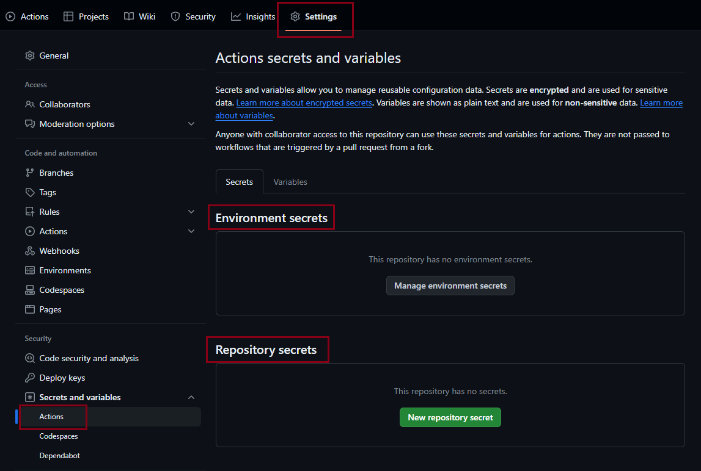
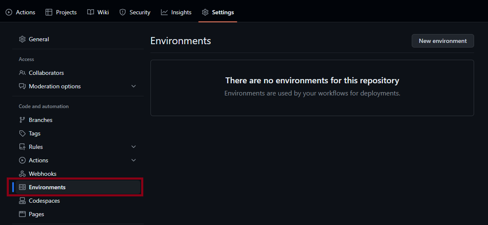

# Create CI pipeline

## GitHub Action
### GitHub Repo name 설정
```
export GIT_REPO_NAME='XXXXXXXXXXX'
```

### `.github` 디렉토리 생성
```
cd ~/environment/$GIT_REPO_NAME
mkdir -p ./.github/workflows
```

### Github Actions secrets and variables
우선 순위 : Environment > Repository > Organization


Environment secret 또는 variable 생성을 위해서는 `Environment` 가 필요.



### github action이 사용할 build.yaml 생성
순서: checkout -> build -> push

cloud9에서 $ECR_REPOSITORY 설정 필요!!!!!

**main-build.yaml**
```
cd ~/environment/$GIT_REPO_NAME/.github/workflows
cat > main-build.yaml <<EOF

name: Build Main

on:
  push:
    branches: [ main ]
    - './code/flyway-example/*'
  pull_request:
    branches: [ "main" ]
    - './code/flyway-example/*'
      
jobs:
  build:
    environment: ECR
    
    runs-on: ubuntu-latest
    steps:
      - name: Checkout source code
        uses: actions/checkout@v3

      - name: Set up JDK 17
        uses: actions/setup-java@v3
        with:
          java-version: '17'
          distribution: 'corretto'

      - name: Configure AWS credentials
        uses: aws-actions/configure-aws-credentials@v1
        with:
          aws-access-key-id: \${{ secrets.AWS_ACCESS_KEY_ID }}
          aws-secret-access-key: \${{ secrets.AWS_SECRET_ACCESS_KEY }}
          aws-region: $AWS_REGION

      - name: Login to Amazon ECR
        id: login-ecr
        uses: aws-actions/amazon-ecr-login@v1

      - name: Build, tag, and push image to Amazon ECR
        id: image-info
        env:
          ECR_REGISTRY: \${{ steps.login-ecr.outputs.registry }}
          ECR_REPOSITORY: $ECR_REPOSITORY
          IMAGE_TAG: v1
        run: |
          echo "::set-output name=ecr_repository::\$ECR_REPOSITORY"
          working-directory: ./code/flyway-example
          ./gradlew clean build
          cp ./build/libs/*.jar ./app.jar
          docker build --file Dockerfile --build-arg CI_ENVIRONMENT=${{ vars.CI_ENVIRONMENT }} -t main-${{github.run_number}} .
          docker image tag main-${{github.run_number}} $ECR_REGISTRY/$ECR_REPOSITORY:main-${{github.run_number}}
          

      - name: Run Trivy vulnerability scanner
        env:
          ECR_REGISTRY: \${{ steps.login-ecr.outputs.registry }}
          ECR_REPOSITORY: \${{ steps.image-info.outputs.ecr_repository }}
          IMAGE_TAG: \${{ steps.image-info.outputs.image_tag }}      
        uses: aquasecurity/trivy-action@master
        with:
          image-ref: \$ECR_REGISTRY/\$ECR_REPOSITORY:main-${{github.run_number}}
          format: 'table'
          exit-code: '0'
          ignore-unfixed: true
          vuln-type: 'os,library'
          severity: 'CRITICAL,HIGH'
          
      - name: Push image to Amazon ECR
        id: image-push
        env:
          ECR_REGISTRY: \${{ steps.login-ecr.outputs.registry }}
          ECR_REPOSITORY: \${{ steps.image-info.outputs.ecr_repository }}
          IMAGE_TAG: \${{ steps.image-info.outputs.image_tag }}
        run: |
          echo "::set-output name=ecr_repository::\$ECR_REPOSITORY"
          docker push $ECR_REGISTRY/$ECR_REPOSITORY:main-${{github.run_number}}      

EOF
```


### GitHub Action workflow 확인
1. Code를 push하여 github action workflow 실행.
```
cd ~/environment/$GIT_REPO_NAME
git add .
git commit -m "Add github action build script"
git push origin main
```
2. Browser에서 `run workflow` 버튼 클릭하여 실행.

정상 build 확인 후 image가 ECR에 제대로 push 되었는지 확인.
