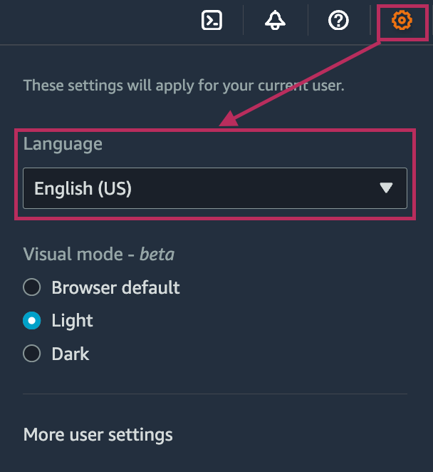
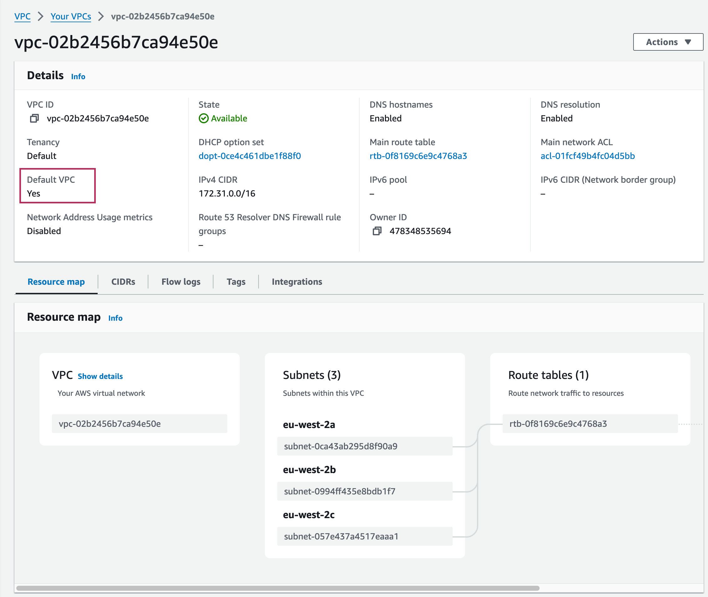
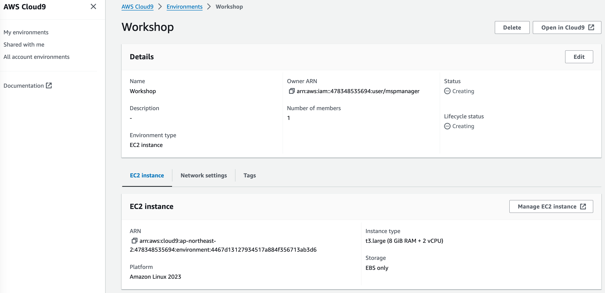
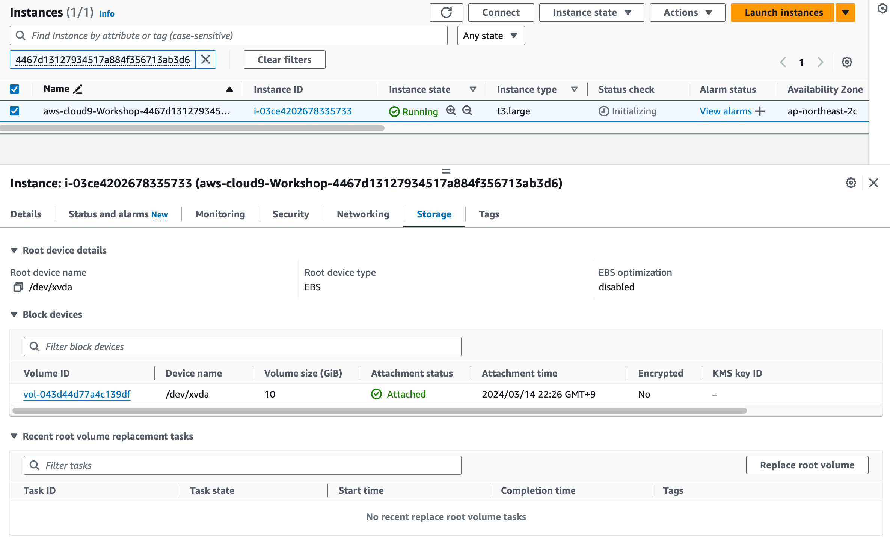
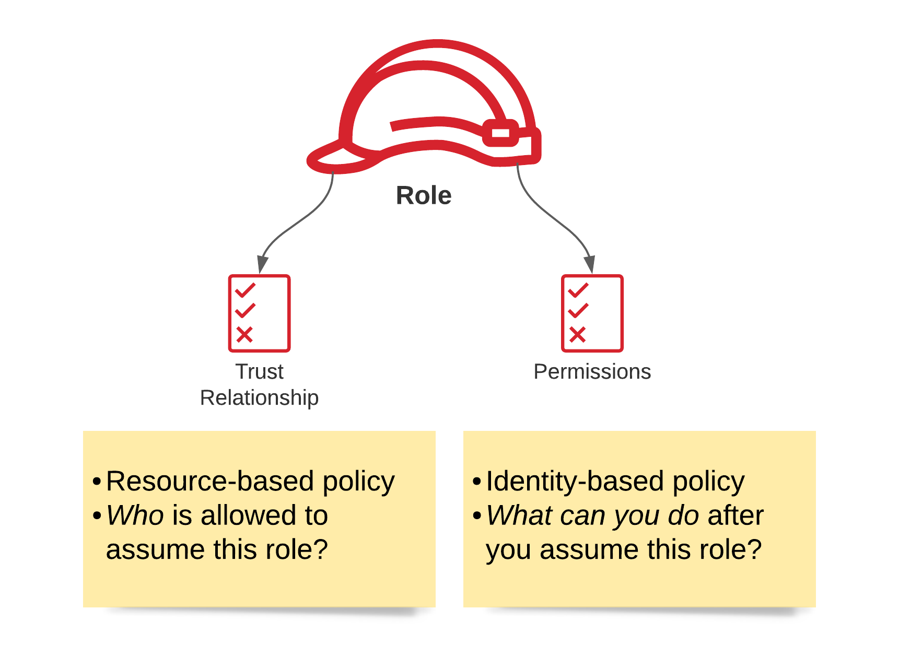
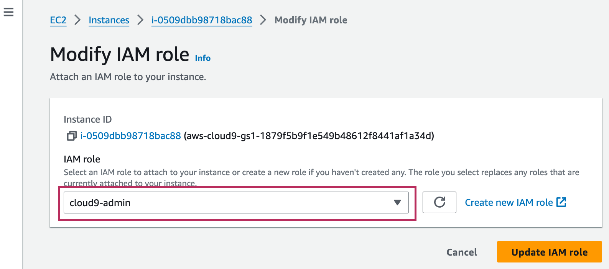

## Cloud9 IDE 환경 구성
`Lab Location`: :cloud:

### AWS Console 언어 설정
AWS Console 은 언어 설정이 `Browser default` 이며 한글로 표시 되는 사람은 `English` 로 변경 필요.



### Default VPC 생성

0번 실습

Region 이 Seoul 인지 확인

`Search` 에서 `VPC` 로 검색 > [좌측의 Virtual private cloud - Your VPCs 선택](https://ap-northeast-2.console.aws.amazon.com/vpcconsole/home?region=ap-northeast-2#vpcs:)

Default VPC 가 없다면 생성
(이미 생성되어 있는 VPC가 있다 하더라도 Default 가 아닌 경우 Default VPC 생성 필요)


`Create default VPC` 클릭


Default VPC Detail


:coffee:    **Record - VPC Creation**


### Cloud9 IDE 생성

1번 실습

`Seoul region` 확인 후 AWS 서비스에서 Cloud9을 선택하고, "Create Environments" 버튼을 클릭한다.  


Cloud9 이름과 Descriiption을 설정한다. 


### Cloud9 구성
Instance type 변경

Instance type - Additional instance types - t3.large  


> [!NOTE]
> Cloud9 하단의 설정 메뉴 중에 Network Setting은 변경하지 않으면, 자동으로 VPC Default로 설정되며 Cloud9 인스턴스는 해당 Default VPC의 public subnet에 자동으로 설치된다.

AWS Console에서 Cloud9 생성 확인


:coffee:    **Record - Cloud9 Creation**


### Cloud9 storage 증설

2번 실습

Cloud9 세부 페이지 - `Manage EC2 instance` 클릭

해당 인스턴스 check - 아래 상세 정보 Storage Tab - Block devices - Volume ID 클릭

해당 Volume check - Actions - Modify volume

Size 30 으로 변경


:coffee:    **Record - Modify EBS Volume**


"Open"을 눌러 Cloud9 IDE를 오픈합니다.


Linux Partition 크기 조정
```bash
df -h
sudo growpart /dev/nvme0n1 1
```

확인
```bash
lsblk
NAME          MAJ:MIN RM SIZE RO TYPE MOUNTPOINTS
nvme0n1       259:0    0  30G  0 disk 
├─nvme0n1p1   259:1    0  30G  0 part /
├─nvme0n1p127 259:2    0   1M  0 part 
└─nvme0n1p128 259:3    0  10M  0 part /boot/efi
```

EC2 reboot
```bash
sudo reboot -f
```

:coffee:    **Record - Modify Linux partition**


### AWS IAM Role


### Cloud9 IAM Role 생성 및 변경

3번 실습

Administrator access 정책을 가진 IAM Role을 생성하여 AWS Cloud9에 할당.
> [!NOTE]
> 본 실습의 경우, AdministratorAccess 정책을 사용하지만 실제 프로덕션 환경을 구동할 때에는 최소 권한을 부여하는 것이 적합.

#### Role 생성
1. AdministratorAccess 권한을 가진 role 생성:  
Search - IAM - 좌측 Access management 영역 Roles 선택 - Create role 클릭


2. Step 1 Select trusted entity:  
Trusted entity type - AWS service, Use case - EC2 선택

3. Permissions policies 에서 `AdministratorAccess` 체크 후 Next
4. Role name `cloud9-admin` 입력 후 Create role 버튼 클릭

:coffee:    **Record - Create Admin role**


#### Cloud9에 Role 부여

1. [EC2 Instance page](https://console.aws.amazon.com/ec2/v2/home?#Instances:sort=desc:launchTime)를 클릭하여 EC2 인스턴스 페이지에 접속
2. 해당 인스턴스를 선택 후, Actions > Security > Modify IAM Role을 클릭
   
3. IAM Role에서 `cloud9-admin` 선택 후 Update IAM role 클릭
   

### Cloud9에서 IAM 설정 업데이트
AWS Cloud9의 경우, IAM credentials을 동적으로 관리 함,  따라서 이 credentials을 비활성화 하고 조금 전 생성한 IAM role을 부여  

1. AWS Cloud9 IDE 접속 - 우측 상단 기어 아이콘 클릭 
2. 좌측 AWS Settings 메뉴선택 - 우측 Credentials 에서 AWS managed temporary credentials 비활성화
   
3. Temporary credentials이 없는지 확실히 하기 위해 기존의 자격 증명 파일도 제거
```bash
rm -vf ${HOME}/.aws/credentials 
```
4. `GetCallerIdentity CLI` 명령어를 통해, Cloud9 IDE가 올바른 IAM Role을 사용하고 있는지 확인
```bash
aws sts get-caller-identity --query Arn | grep cloud9-admin
```

### Cloud9 환경 변수 설정
환경변수: ACCOUNT_ID, AWS_REGION 정보 설정
```bash
# ACCOUNT_ID
export ACCOUNT_ID=$(aws sts get-caller-identity --output text --query Account)
echo "export ACCOUNT_ID=$(aws sts get-caller-identity --output text --query Account)" >> ~/.bashrc

# AWS_REGION
export AWS_REGION=ap-northeast-2
echo "export AWS_REGION=ap-northeast-2" >> ~/.bashrc
```
확인
```bash
echo "ACCOUNT_ID: " $ACCOUNT_ID
echo "AWS_REGION: " $AWS_REGION
```

:coffee:    **Record - Modify Cloud9 role**


### Cloud9 에 패키지 설치
#### **Kubectl 설치**
EKS를 위한 kubectl 바이너리를 다운로드합니다. Kubernetes 버전 1.23 출시부터 공식적으로 Amazon EKS AMI에는 containerd가 유일한 런타임으로 포함된다.
> [!NOTE]
> Amazon EKS 클러스터 제어 영역과 마이너 버전이 하나 다른 kubectl 버전을 사용해야 한다. 예를 들어 1.28 kubectl 클라이언트는 Kubernetes 1.27, 1.28, 1.29 클러스터와 함께 작동한다.

```bash
# kubectl download
curl -O https://s3.us-west-2.amazonaws.com/amazon-eks/1.28.5/2024-01-04/bin/linux/amd64/kubectl


# 바이너리에 실행 권한을 적용
chmod +x ./kubectl

# 바이너리를 PATH의 폴더에 복사 및 설정
mkdir -p $HOME/bin && cp ./kubectl $HOME/bin/kubectl && export PATH=$HOME/bin:$PATH
echo 'export PATH=$HOME/bin:$PATH' >> ~/.bashrc

# 자동완성
source <(kubectl completion bash) 
echo "source <(kubectl completion bash)" >> ~/.bashrc

alias k=kubectl
complete -o default -F __start_kubectl k

echo "alias k=kubectl" >> ~/.bashrc
echo "complete -o default -F __start_kubectl k" >> ~/.bashrc

source ~/.bashrc

# kubectl 버전 확인
kubectl version --client
```

#### **kubeconfig 다운로드**

> [!NOTE]
> KUBECONFIG URL 은 별도로 전달.
```bash
export KUBECONFIG_URL="XXX"

mkdir -p ~/.kube
wget -O ~/.kube/config $KUBECONFIG_URL
```


#### **Homebrew 설치**
Homebrew는 Apple(또는 Linux 시스템)에서 제공하지 않는 유용한 패키지 관리자를 설치.  

> [!NOTE]
> homebrew설치할때 패스워드 묻기 때문에 미리 설정.

ec2-user 패스워드 설정
```
sudo passwd ec2-user
```

homebrew 설치
```bash
/bin/bash -c "$(curl -fsSL https://raw.githubusercontent.com/Homebrew/install/HEAD/install.sh)"
```

brew 관련 설정을 profile에 추가합니다.
```bash

(echo; echo 'eval "$(/home/linuxbrew/.linuxbrew/bin/brew shellenv)"') >> /home/ec2-user/.bash_profile

eval "$(/home/linuxbrew/.linuxbrew/bin/brew shellenv)"
```

설치 확인
```
brew -v
```

#### **Helm 설치**
Helm은 쿠버네티스를 위한 패키지 관리 도구.  

설치 
```
brew install helm
```

설치 확인
```
helm version
```

:coffee:    **Record - Install Packages**


[Next - Configuration](./Configuration.md)
