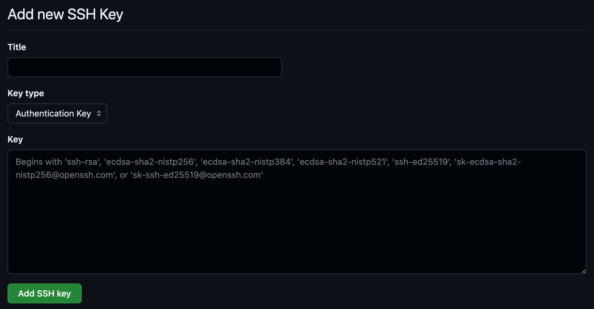
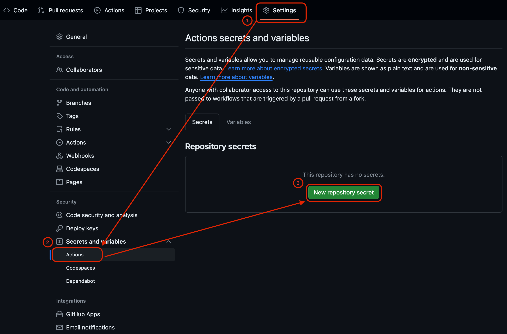

# Prerequisites

## ECR Repository 생성
AWS CLI를 통해, 이미지 리포지토리를 생성.  
repository name: msa-ref-biz-order  
```
export ECR_REPOSITORY="ci-sample"
export AWS_REGION="ap-northeast-2"

aws ecr create-repository \
--repository-name ${ECR_REPOSITORY} \
--image-scanning-configuration scanOnPush=true \
--region ${AWS_REGION}
```

## GitHub 설정
### Git Clone
```bash
git clone https://github.com/ieyei/class-ci.git
cd class-ci/
```


### Git 인증
> [!NOTE]  
> 만약 push 과정에서, username, password 를 매번 넣어야 하는 상황이 번거롭다면 아래와 같이 cache 설정을 통해 지정 된 시간(기본 15분) 동안 cache 기반으로 로그인 가능.
 
username, email 내용을 본인에 맞게 변경
```
export USERNAME="MY USERNAME"
export EMAIL="MY EMAIL"

git config --global user.name ${USERNAME}
git config --global user.email ${EMAIL}
git config credential.helper store
git config --global credential.helper 'cache --timeout 3600'
```

> [!NOTE]
> github MFA 인증을 사용 하고 있는 경우, personal access token을 만들어 password로 사용.
> personal access token 만드는 방법: [Managing your personal access tokens](https://docs.github.com/en/authentication/keeping-your-account-and-data-secure/managing-your-personal-access-tokens#creating-a-fine-grained-personal-access-token)
---

#### ssh 연결
**ssh key 생성**
참고 URL: [Generating a new SSH key](https://docs.github.com/en/authentication/connecting-to-github-with-ssh/generating-a-new-ssh-key-and-adding-it-to-the-ssh-agent?platform=mac#generating-a-new-ssh-key)  
email 주소는 github 가입 시 사용한 주소로 변경
```
$ ssh-keygen -t rsa -b 4096 -C ${EMAIL}
Generating public/private rsa key pair.
Enter file in which to save the key (/home/ec2-user/.ssh/id_rsa): 
Enter passphrase (empty for no passphrase): 
Enter same passphrase again: 
Your identification has been saved in /home/ec2-user/.ssh/id_rsa
Your public key has been saved in /home/ec2-user/.ssh/id_rsa.pub
The key fingerprint is:
SHA256:vHTZ6QOy+0iNVIFGq12RYtIEZZ0Z3vQCipP/xURq4SI your_email@example.com
The key's randomart image is:
+---[RSA 4096]----+
|      .*=o*=o    |
|      .+*==X .   |
|      E++.B + .  |
|       B = = o   |
|      . S + =    |
|       o O +     |
|        = o o    |
|       . o   .   |
|        o..      |
+----[SHA256]-----+
```

public key 복사
```
cat ~/.ssh/id_rsa.pub
```

1. github 페이지 우측 상단 profile 클릭
2. Settings 선택
3. Settings 상세페이지 좌측 Access > `SSH and GPG keys` 클릭
4. ssh key 등록(Key 영역에 위에서 생성한 pub key 내용 붙여 넣기)



### Sample code git clone
실습을 위해 sample code `git clone`을 한다.  
Terminal에서 git clone   
SAMPLE-REPO="class-ci"
> [!NOTE]
> Are you sure you want to continue connecting (yes/no/[fingerprint])? --> 묻는 단계가 나올 경우 `yes`

```
$ git clone git@github.com:ieyei/class-ci.git
```

### CI 파이프라인을 위한 AWS IAM 생성 및 policy 설정
sample app을 빌드 하고, docker image로 만든 다음 ECR에 push 하는 과정은 `gitHub Action`을 통해 이루어지며 이 때 least privilege 정책에 따른 IAM User 생성.

#### IAM User 생성
```
aws iam create-user --user-name github-action
```

#### ECR Policy 생성
ecr-policy.json 이름으로 policy 생성.

```
cd ~/environment
cat <<EOF> ecr-policy.json
{
    "Version": "2012-10-17",
    "Statement": [
        {
            "Sid": "AllowPush",
            "Effect": "Allow",
            "Action": [
                "ecr:GetDownloadUrlForLayer",
                "ecr:BatchGetImage",
                "ecr:BatchCheckLayerAvailability",
                "ecr:PutImage",
                "ecr:InitiateLayerUpload",
                "ecr:UploadLayerPart",
                "ecr:CompleteLayerUpload"
            ],
            "Resource": "arn:aws:ecr:${AWS_REGION}:${ACCOUNT_ID}:repository/$ECR_REPOSITORY"
        },
        {
            "Sid": "GetAuthorizationToken",
            "Effect": "Allow",
            "Action": [
                "ecr:GetAuthorizationToken"
            ],
            "Resource": "*"
        }
    ]
}
EOF
```

`ecr-policy` 이름으로 IAM policy 생성.
```
aws iam create-policy --policy-name ecr-policy --policy-document file://ecr-policy.json
```

#### ECR policy를 IAM user에 부여
IAM user에게 새로 생성한 ecr-policy 할당.
```
aws iam attach-user-policy --user-name github-action --policy-arn arn:aws:iam::${ACCOUNT_ID}:policy/ecr-policy
```

### AWS Credential 생성 및 설정
gitHub action에서 사용할 AWS credential 생성 및 설정.

**AWS Credential 생성**  
앞 단계에서 생성한 IAM User의 Access Key, Secret Key 생성.
```
aws iam create-access-key --user-name github-action
```
출력 결과의 `SecretAccessKey`, `AccessKeyId` 값은 따로 저장.
```
{
  "AccessKey": {
    "UserName": "github-action",
    "Status": "Active",
    "CreateDate": "xxx",
    "SecretAccessKey": "***",
    "AccessKeyId": "***"
  }
}
```
> [!NOTE]
> `SecretAccessKey`, `AccessKeyId` 값은 최초 생성 할 때만 확인 가능.

**AWS Credential 설정**  
Repository 상단 `Settings` 클릭 후 좌측 메뉴 `Secrets and variables > Actions` 클릭.  
`New repository secret` 버튼을 클릭하여 앞서 저장한 IAM User `github-action`의 `SecretAccessKey`, `AccessKeyId` 값을 Secret에 저장.  



Actions 클릭 후 Actions secrets and variables 화면에서 `new repository secret` 클릭 후 `AWS_ACCESS_KEY_ID`,`AWS_SECRET_ACCESS_KEY` 각각 등록.

Name: `AWS_ACCESS_KEY_ID`  
Secret: AccessKeyId 의 값  

Name: `AWS_SECRET_ACCESS_KEY`  
Secret: SecretAccessKey 의 값

등록 후 화면

