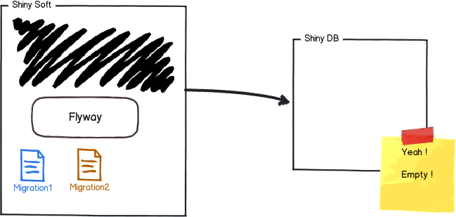
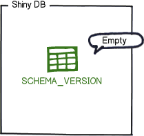
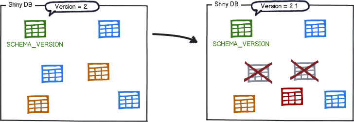

# Flyway

Flyway는 데이터베이스 마이그레이션 도구이다. 이 문서에서는 Flyway를 사용하는 방법과 CI/CD에서의 활용을 다룬다.

## Table of Contents

- [1. Flyway CLI / Gradle](#1-flyway-cli--gradle)
  - [1.1 Flyway란?](#11-flyway란)
  - [1.2 How to use Flyway](#12-how-to-use-flyway)
    - [1.2.1 Info](#121-info)
    - [1.2.2 Migrate](#122-migrate)
    - [1.2.3 Validate](#123-validate)
    - [1.2.4 Baseline](#124-baseline)
    - [1.2.5 Clean](#135-clean)
  - [1.3 How works Flyway(이론)](#14-how-works-flyway)
    - [1.3.1 flyway_schema_history Table](#141-flyway_schema_history-table)
  - [1.4. Play With Gradle](#15-play-with-gradle)
    - [1.4.1 build.gradle](#151-buildgradle)
    - [1.4.2 Add Versioned Migration](#152-add-versioned-migration)
- [2. Integrate to CI/CD](#2-integrate-to-cicd)
  - [2.1 Validate @ CI](#21-validate--ci)
  - [2.2 migrate @ CD](#22-migrate--cd)

## 1. Flyway CLI / Gradle

이 실습에서는 H2 DB를 실행시키고 그 위에서 직접 명령어를 실행해가며 변화를 파악해보는 과정으로 진행한다.

### 1.1 Flyway란?

Flyway: 데이터베이스 마이그레이션 도구

마이그레이션: 데이터베이스의 스키마(schema)를 한 버전에서 다른 버전으로 업그레이드하거나 변경하는 과정이다.

### 1.2 How to use Flyway

- [Flyway CLI and API - Commnads](https://documentation.red-gate.com/fd/commands-184127446.html)
- [Flyway with Gradle](https://documentation.red-gate.com/fd/quickstart-gradle-184127577.html)

** 실습은 아래 경로에서 진행한다**
```
cd code/flyway-example
```

`-PprojectDir=$PWD` 를 통해 현재 디렉토리에 sqlite db를 생성해 실행한다. 잘못된 경우, database를 없애고 싶다면 test.mv.db 파일을 삭제하면 된다.


#### 1.2.1 Info

현재 데이터베이스의 마이그레이션 상태에 대한 상세한 정보를 제공한다. 적용된 것과 적용될 것을 비교하여 나타내며 실패한 마이그레이션은 해당 정보를 표현해준다.


```shell
#결과
./gradlew flywayInfo -PprojectDir=$PWD

> Task :flywayInfo
Schema version: << Empty Schema >>
+-----------+---------+----------------------+------+--------------+---------+----------+
| Category  | Version | Description          | Type | Installed On | State   | Undoable |
+-----------+---------+----------------------+------+--------------+---------+----------+
| Versioned | 1       | Create user table    | SQL  |              | Pending | No       |
| Versioned | 2       | Add admin user       | SQL  |              | Pending | No       |
| Versioned | 2.1     | Add some user        | SQL  |              | Pending | No       |
| Versioned | 3       | Create profile table | SQL  |              | Pending | No       |
+-----------+---------+----------------------+------+--------------+---------+----------+
```

#### 1.2.2 Migrate

데이터베이스에 반영하는 과정이다. 순차적으로 실행하며, 이 버전은 메타테이블(flyway_schema_history)에 기록된다.


```shell
./gradlew flywayMigrate -PprojectDir=$PWD

# 결과
BUILD SUCCESSFUL in 696ms
1 actionable task: 1 executed


```

#### 1.2.3 Validate

마이그레이션 스크립트와 데이터베이스의 현재 상태를 비교하여 일치하는지 확인하는 과정이다. 불일치를 찾아내서 실수나 오류가 발생하기 전에 미리 알려준다.

특히, 각 파일은 checksum을 통해 고유성을 보장하므로 변경을 감지할 수 있다.


```shell
./gradlew flywayValidate -PprojectDir=$PWD

#결과
Database: jdbc:h2:file:/Users/ieyei/test (H2 2.2)
Successfully validated 4 migrations (execution time 00:00.014s)
```

#### 1.2.4 Clean

데이터베이스 내의 모든 스키마, 테이블, 뷰, 저장 프로시저, 함수, 트리거 등을 삭제하여 데이터베이스를 초기 상태로 되돌리는 기능이다. 운영에서 사용하면 안되기 때문에 나름의 안전장치가 포함되어있다.


```shell
./gradlew flywayClean -Pflyway.cleanDisabled="false" -PprojectDir=$PWD
./gradlew flywayInfo -PprojectDir=$PWD


#결과: 모두 지워져 State 가 Pending으로 되돌아간다.
+-----------+---------+----------------------+------+--------------+---------+----------+
| Category  | Version | Description          | Type | Installed On | State   | Undoable |
+-----------+---------+----------------------+------+--------------+---------+----------+
| Versioned | 1       | Create user table    | SQL  |              | Pending | No       |
| Versioned | 2       | Add admin user       | SQL  |              | Pending | No       |
| Versioned | 2.1     | Add some user        | SQL  |              | Pending | No       |
| Versioned | 3       | Create profile table | SQL  |              | Pending | No       |
+-----------+---------+----------------------+------+--------------+---------+----------+
```


#### 1.2.5 Baseline

기존에 있던 데이터베이스에 flyway를 도입할 때 사용한다.


```shell
# baseline과 info를 실행한다.
./gradlew flywayBaseline flywayInfo -PprojectDir=$PWD -Pflyway.baselineVersion=0.1 -Pflyway.baselineDescription="init schema"

#결과
> Task :flywayInfo
Schema version: 0.1
+-----------+---------+----------------------+----------+---------------------+----------+----------+
| Category  | Version | Description          | Type     | Installed On        | State    | Undoable |
+-----------+---------+----------------------+----------+---------------------+----------+----------+
|           | 0.1     | init schema          | BASELINE | 2024-06-18 13:20:59 | Baseline | No       |
| Versioned | 1       | Create user table    | SQL      |                     | Pending  | No       |
| Versioned | 2       | Add admin user       | SQL      |                     | Pending  | No       |
| Versioned | 2.1     | Add some user        | SQL      |                     | Pending  | No       |
| Versioned | 3       | Create profile table | SQL      |                     | Pending  | No       |
+-----------+---------+----------------------+----------+---------------------+----------+----------+
```

### 1.4 How works Flyway (이론)

1. flyway_schema_history Table을 찾는다.

   

2. 없으므로 새로 생성한다. 이제 상태를 추적하는 상태가 되었다.

   

3. 마이그레이션을 하기 위해 번호를 기준으로 마이그레이션을 정렬 하고 순서대로 적용한다.

   

4. `flyway_schema_history` 테이블에 적용된 마이그레이션을 기록한다.

   

5. 또 다른 최신 버전으로 이행을 해 본다. 보류 중인 마이그레이션을 준비한다. 여기에서는 refactoring을 위해 table 2개를 삭제하는 migration을 예로 든다.

   

6. 실행하면 마이그레이션을 적용한다.

   

7. 결과를 기록한다. 버전이 계속 쌓이는것에 주목할 필요가 있다.

   

#### 1.4.1 flyway_schema_history Table

flyway_schema_history 테이블은 Flyway가 데이터베이스 마이그레이션을 관리하는데 사용하는 중요한 메타데이터 테이블이다.

이 테이블에는 실행된 마이그레이션 스크립트의 이력이 저장되며, Flyway는 이 정보를 사용하여 데이터베이스의 현재 스키마 버전을 파악하고, 어떤 마이그레이션 스크립트가 이미 적용되었는지, 어떤 스크립트가 아직 적용되지 않았는지 등을 결정한다.

**주목해야 할 내용**

- 버전 관리와 순서: version과 installed_rank를 통해 마이그레이션의 순서와 적용된 버전을 쉽게 파악할 수 있다. 이 정보를 사용하여 데이터베이스 스키마의 현재 상태를 확인하고, 필요한 마이그레이션 작업을 계획할 수 있다.
- 무결성 검증: checksum 컬럼을 통해 마이그레이션 파일의 변경 여부를 확인할 수 있다. 이는 마이그레이션 파일이 변경되었을 때 데이터베이스의 무결성에 영향을 줄 수 있기 때문에 중요하다.
- 문제 해결: 마이그레이션 적용 과정에서 문제가 발생했다면, success 컬럼을 확인하여 어떤 마이그레이션이 실패했는지 파악할 수 있다. execution_time과 installed_on 정보를 통해 문제 발생 시점과 소요 시간을 알 수 있으며, 이를 통해 트러블슈팅이 가능하다.

##### flyway_schema_history 예시

| installed_rank | version | description                                  | type | script                                              | checksum    | installed_by | installed_on          | execution_time | success |
|---|---|---|---|---|---|----|---|---|---|
| 1 | 0.1     | init schema | SQL  | V0_1__init schema.sql | -1315154208 | flyway | 58:21.5 | 502 | TRUE    |
| 2 | 0.2 | CREATE batch setting main | SQL | V0_2__CREATE_batch_setting_main.sql | 1604764197  | flyway | 05:16.5 | 80  | TRUE |
| 3 | 0.3 | ALTER XX TABLES ADD COLUMNS BY V | SQL | V0_3__ALTER_XX_TABLES_ADD_COLUMNS_BY_V.sql | -884138263  | flyway | 53:36.2 | 919 | TRUE |
| 4 | 0.4 | ALTER XX TABLES RENAME FINAL UPDATE TIMESTAMP | SQL | V0_4__ALTER_XX_TABLES_RENAME_FINAL_UPDATE_TIMESTAMP.sql | -1577194743 | flyway | 20:53.2 | 243 | TRUE |
| 5 | 0.5 | ALTER table setting batch schedule main | SQL | V0_5__ALTER_table_setting_batch_schedule_main.sql | -1239577890 | flyway | 13:23.3 | 91  | TRUE |

### 1.4. Play With Gradle

Spring Boot과 통합하기 위해 Gradle plugin이 준비되어 있다. 이를 통해 빌드 스크립트에 마이그레이션을 쉽게 추가할 수 있으며, 쉽게 빌드 프로세스에 통합할 수 있다.

#### 1.4.1 build.gradle

```gradle 최소한의 설정
dependencies {
    implementation 'com.h2database:h2'                // db대용
    implementation 'org.flywaydb:flyway-core'         // spring boot과의 통합을 위한 라이브러리
    implementation 'org.springframework.boot:spring-boot-starter-web'
    implementation 'org.springframework.boot:spring-boot-starter-jdbc'
    ...
}
```

이 상태에서 gradle :bootRun을 실행하면, flyway가 자동으로 실행되어 데이터베이스를 초기화하고, 마이그레이션을 적용한다.

`org.flywaydb:flyway-core` 는 Spring boot과의 통합을 위해 필요하다.
이를 위한 설정들은 spring-boot-autoconfigure 에 기본적으로 준비가 되어있다. 따라서 자세한 spring과의 연계설정은 `org.springframework.boot.autoconfigure.flyway.FlywayProperties` 를 참조해 커스텀 하는데 사용을 하면 좋다.
개발 단계에서 로컬 설정을 공유하기 위해 application.properties 파일에 일부 설정을 한다.

spring boot이 작동하며 flyway가 실행되는 구체적인 내용은 `org.springframework.boot.autoconfigure.flyway.FlywayAutoConfiguration Flyway flyway()` 빈을 통해 확인할 수 있다.

아래 명령어를 통해 실행한다. 로그에 migration 이 되었는지 확인한다.

```shell
rm ~/test*.db   # 기존 데이터베이스 삭제
./gradlew bootRun
```

결과

```shell result
2024-03-15T09:27:17.146+09:00  INFO 65279 --- [           main] org.flywaydb.core.FlywayExecutor         : Database: jdbc:h2:file:~/test (H2 2.2)
2024-03-15T09:27:17.151+09:00  WARN 65279 --- [           main] o.f.c.internal.database.base.Database    : Flyway upgrade recommended: H2 2.2.224 is newer than this version of Flyway and support has not been tested. The latest supported version of H2 is 2.2.220.
2024-03-15T09:27:17.160+09:00  INFO 65279 --- [           main] o.f.c.i.s.JdbcTableSchemaHistory         : Schema history table "PUBLIC"."flyway_schema_history" does not exist yet
2024-03-15T09:27:17.161+09:00  INFO 65279 --- [           main] o.f.core.internal.command.DbValidate     : Successfully validated 4 migrations (execution time 00:00.006s)
2024-03-15T09:27:17.164+09:00  INFO 65279 --- [           main] o.f.c.i.s.JdbcTableSchemaHistory         : Creating Schema History table "PUBLIC"."flyway_schema_history" ...
2024-03-15T09:27:17.175+09:00  INFO 65279 --- [           main] o.f.core.internal.command.DbMigrate      : Current version of schema "PUBLIC": << Empty Schema >>
2024-03-15T09:27:17.177+09:00  INFO 65279 --- [           main] o.f.core.internal.command.DbMigrate      : Migrating schema "PUBLIC" to version "1 - Create user table"
2024-03-15T09:27:17.181+09:00  INFO 65279 --- [           main] o.f.core.internal.command.DbMigrate      : Migrating schema "PUBLIC" to version "2 - Add admin user"
2024-03-15T09:27:17.185+09:00  INFO 65279 --- [           main] o.f.core.internal.command.DbMigrate      : Migrating schema "PUBLIC" to version "2.1 - Add some user"
2024-03-15T09:27:17.188+09:00  INFO 65279 --- [           main] o.f.core.internal.command.DbMigrate      : Migrating schema "PUBLIC" to version "3 - Create profile table"
2024-03-15T09:27:17.193+09:00  INFO 65279 --- [           main] o.f.core.internal.command.DbMigrate      : Successfully applied 4 migrations to schema "PUBLIC", now at version v3 (execution time 00:00.003s)
2024-03-15T09:27:17.250+09:00  INFO 65279 --- [           main] o.s.b.w.embedded.tomcat.TomcatWebServer  : Tomcat started on port 8080 (http) with context path ''
2024-03-15T09:27:17.255+09:00  INFO 65279 --- [           main] c.e.flyway.FlywayExampleApplication      : Started FlywayExampleApplication in 1.124 seconds (process running for 1.266)
```

`http://localhost:8080/h2` 에서 확인 후 아래 명령어를 통해 테이블을 삭제한다.

```sql
DROP TABLE IF EXISTS user_profiles;
DROP TABLE IF EXISTS users;
DROP TABLE IF EXISTS flyway_schema_history;
```

gradle task를 이용해 flyway를 실행할 수 있다. 이를 위해 의존성을 추가한다.

```gradle
plugins {
    ...
    id "org.flywaydb.flyway" version "10.0.0" // flyway plugin
}
flyway {
    url = 'jdbc:h2:file:./target/flyway_db'
    user = 'sa'
}
```

그러면 gradle task에 flyway가 추가된다. 추가한 task를 확인한다.

```shell 추가된 flyway task들을 확인한다.
./gradlew tasks | grep flyway
```

#### 1.4.2 Add Versioned Migration

새 마이그레이션 파일을 추가한다.

```sql
-- V4__Add_email_unique_constraint.sql
ALTER TABLE users ADD CONSTRAINT email_unique UNIQUE (email);
```

이후 `./gradlew flywayInfo` 를 통해 예상되는 마이그레이션 결과를 확인한다.

```shell
./gradlew flywayInfo
```

## 2. Integrate to CI/CD

CI에서 Flyway Script의 검증과 예상되는 결과에 대한 리뷰 과정이 필요하다. 이 목적을 달성하기 위해 Flyway에서는 validate 와 info기능을 가지고 있다.

### 2.1 Validate @ CI

CI환경에서 여태까지의 flyway script들이 변경되지 않았는지 검증이 필요하다. 
다양한 사람들의 수많은 PR을 검증하다보면, 설계가 변경되고 컬럼이 수정되는 여러 상황들을 피해야 한다.
이런 환경들을 각 계 별로 견고하게 유지하고 싶다면, DB의 형상변경을 PR리뷰를 통해 각 commit을 검증하고, CI pipeline을 통해 Validate하는 과정이 필요하다.

Validate는 현재의 flyway script들과 배포되어 있는 상황을 비교하는 작업이다. 따라서 *신규 버전이 올라가는 경우* 해당 내용은 데이터베이스에 반영되지 않은 내용이므로 fail이 된다.

예) 데이터베이스에 반영되지 않은 신규 버전을 Validate 할 때의 에러 (pending)

```text
> Task :flywayValidate FAILED

FAILURE: Build failed with an exception.

* What went wrong:
Execution failed for task ':flywayValidate'.
> Error occurred while executing flywayValidate
  Validate failed: Migrations have failed validation
  Detected resolved migration not applied to database: 3.
  To fix this error, either run migrate, or set -ignoreMigrationPatterns='*:pending'.
  Need more flexibility with validation rules? Learn more: https://rd.gt/3AbJUZE
```

현재 시점의 Info를 보면 Pending 이라고 표현되어 Validate 단계에서는 차이가 발견되어 실패함을 알 수 있다.

```text
# DB에 반영되지 않은 버전은 Pending 상태인 것을 알 수 있다.
+-----------+---------+----------------------+------+--------------+---------+----------+
| Category  | Version | Description          | Type | Installed On | State   | Undoable |
+-----------+---------+----------------------+------+--------------+---------+----------+
...
| Versioned | 3       | Create profile table | SQL  |              | Pending | No       |
+-----------+---------+----------------------+------+--------------+---------+----------+
```

CI에서는 migrate 전 데이터베이스의 견고함을 확인하기 위함이므로 `-ignoreMigrationPatterns='*:pending'` 를 추가해 신규 버전의 스키마를 제외한 나머지를 검증하도록 한다.


### 2.2 migrate @ CD

flyway와 gradle의 통합을 통해 쉽게 migrate가 가능하다.
flyway는 운영에 배포될 때 실행되어야 한다. 이를 위해 CD환경에서는 migrate를 실행한다.

```shell
./gradlew flywayMigrate
```

단, Spring boot에서는 flyway가 자동으로 실행되는것이 기본이다.
정책에 따라 다르겠지만 개발/테스트 환경이라면 `./gradlew bootRun`을 통해 실행하면 migrate를 자동으로 실행하며 적용되겠지만
운영환경에서는 충분한 검토를 통해 적용되어야 할 것이다.
