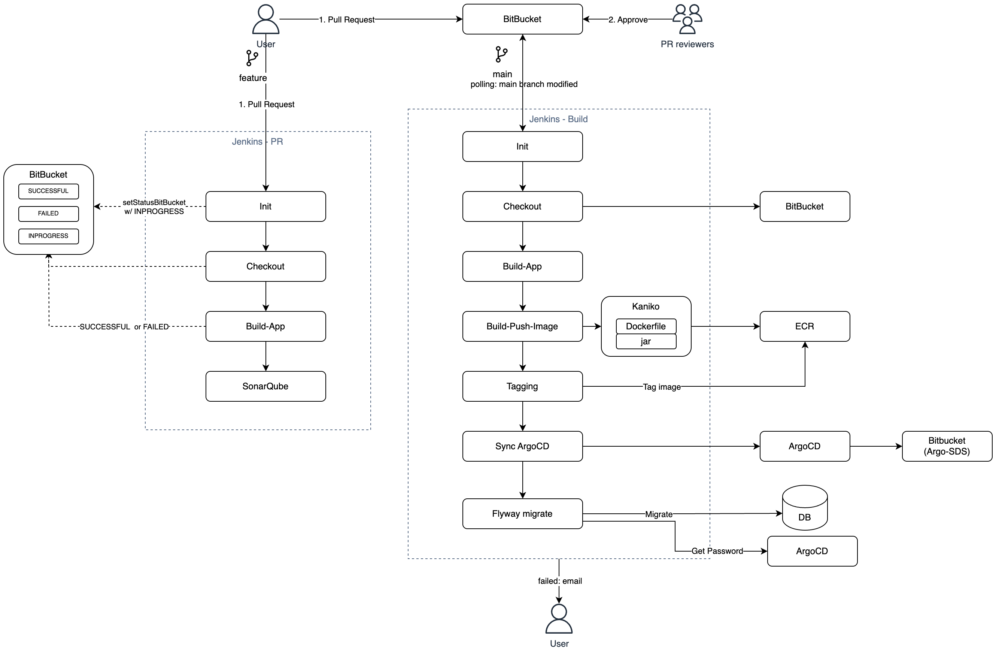

## Security

### Image Scan(10)


Targets (what Trivy can scan):
* Container Image
* Filesystem
* Git Repository (remote)
* Virtual Machine Image
* Kubernetes
* AWS

Scanners (what Trivy can find there):
* OS packages and software dependencies in use (SBOM)
* Known vulnerabilities (CVEs)
* IaC issues and misconfigurations
* Sensitive information and secrets
* Software licenses

## trivy 실습
### Install from GitHub Release (Official)

```
curl -sfL https://raw.githubusercontent.com/aquasecurity/trivy/main/contrib/install.sh | sh -s -- -b $HOME/bin v0.49.1
```

trivy help 확인
```
trivy --help
```
```bash
Scanner for vulnerabilities in container images, file systems, and Git repositories, as well as for configuration issues and hard-coded secrets

Usage:
  trivy [global flags] command [flags] target
  trivy [command]

Examples:
  # Scan a container image
  $ trivy image python:3.4-alpine

  # Scan a container image from a tar archive
  $ trivy image --input ruby-3.1.tar

  # Scan local filesystem
  $ trivy fs .

  # Run in server mode
  $ trivy server

Scanning Commands
  aws         [EXPERIMENTAL] Scan AWS account
  config      Scan config files for misconfigurations
  filesystem  Scan local filesystem
  image       Scan a container image
  kubernetes  [EXPERIMENTAL] Scan kubernetes cluster
  repository  Scan a repository
  rootfs      Scan rootfs
  sbom        Scan SBOM for vulnerabilities
  vm          [EXPERIMENTAL] Scan a virtual machine image

Management Commands
  module      Manage modules
  plugin      Manage plugins

Utility Commands
  completion  Generate the autocompletion script for the specified shell
  convert     Convert Trivy JSON report into a different format
  help        Help about any command
  server      Server mode
  version     Print the version

Flags:
      --cache-dir string          cache directory (default "/Users/ieyei/Library/Caches/trivy")
  -c, --config string             config path (default "trivy.yaml")
  -d, --debug                     debug mode
  -f, --format string             version format (json)
      --generate-default-config   write the default config to trivy-default.yaml
  -h, --help                      help for trivy
      --insecure                  allow insecure server connections
  -q, --quiet                     suppress progress bar and log output
      --timeout duration          timeout (default 5m0s)
  -v, --version                   show version

```


### Use container image
Pull Trivy image
```
docker pull aquasec/trivy:0.49.1
```

```
docker run -v /var/run/docker.sock:/var/run/docker.sock \
    aquasec/trivy:0.49.1 \
    image python:3.4-alpine
```
### Target - Container images
Container image 안 파일들 중 스캔 가능한 항목
* Vulnerabilities (enabled by default)
* Misconfigurations (disabled by default)
* Secrets (enabled by default)
* Licenses (disabled by default)

#### Vulnerabilities

```
trivy image python:3.4-alpine
```
**Severity**  

| Base Score Range | Severity |
|:----------------:| --- |
|     0.1-3.9      | Low |
|     4.0-6.9      | Medium |
|     7.0-8.9      | High |
|       9.0-10.0   | Critical |


특정 이미지(python:3.4-alpine)의 취약점 중 CRITICAL,HIGH 2가지만 조회하는 경우
```
trivy image --severity CRITICAL,HIGH python:3.4-alpine
```

#### Misconfigurations
이미지 안에 Infrastructure as Code (IaC) 가 있다면 스캔 가능
```
trivy image --scanners misconfig [YOUR_IMAGE_NAME]
```

#### Secrets

```
$ trivy image [YOUR_IMAGE_NAME]
```


#### Licenses

```
trivy image --scanners license python:3.4-alpine
```


```
cat <<EOF > Dockerfile
FROM node:18-alpine
WORKDIR /app
COPY . .
RUN yarn install --production
CMD ["node", "src/index.js"]
EXPOSE 3000
EOF
```


**CI와의 통합**

- **CI 파이프라인에 SonarLint 통합**: 자동화된 빌드 및 테스트 파이프라인에 SonarLint를 통합하여 코드 품질 검사를 자동화할 수 있다. 이를 통해 코드 리뷰 과정에서 발견되지 않은 이슈를 조기에 발견하고 해결할 수 있다.
- **SonarQube/SonarCloud와 연동**: 대규모 프로젝트의 경우, SonarLint와 함께 SonarQube 또는 SonarCloud를 사용하여 더 광범위한 코드 품질 관리를 수행한다. CI 파이프라인을 통해 코드 변경 사항을 정기적으로 SonarQube/SonarCloud에 업로드하고, 상세한 코드 품질 보고서를 받을 수 있다.

**참조 프로세스**


