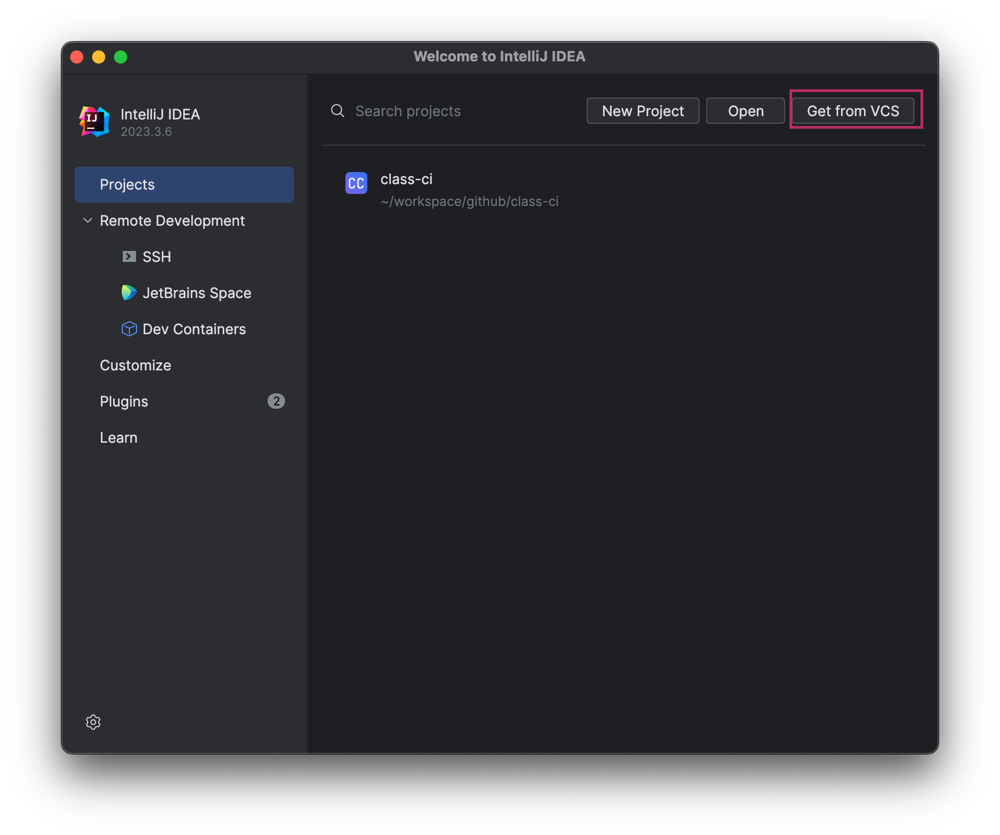
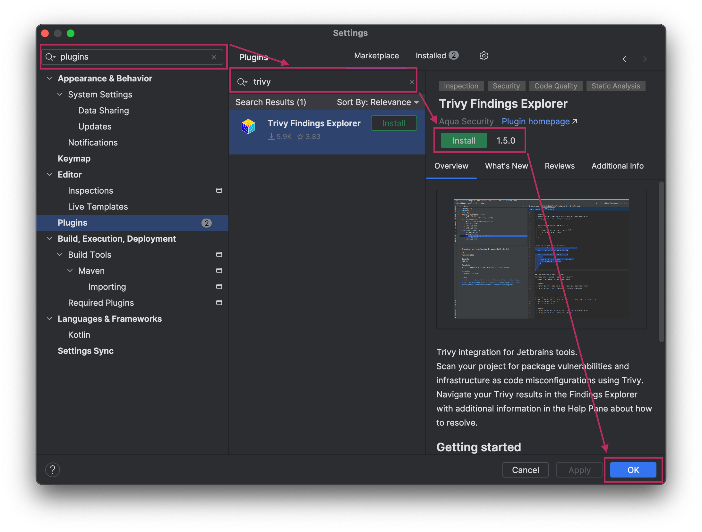
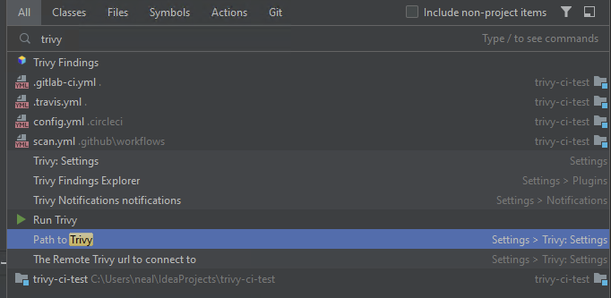
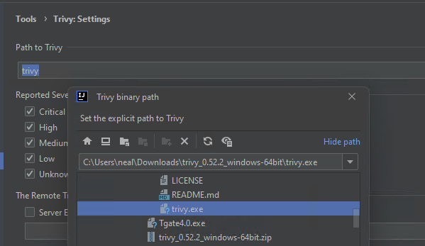
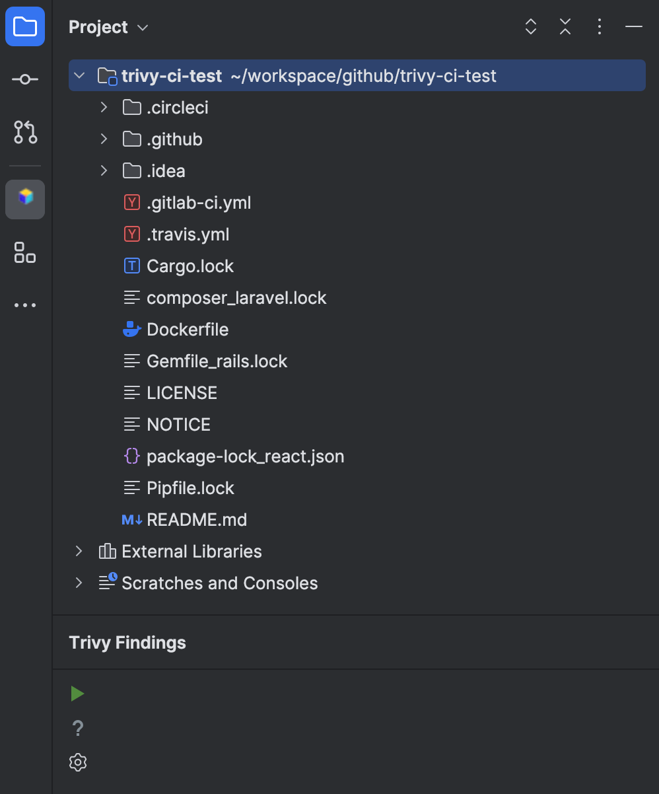
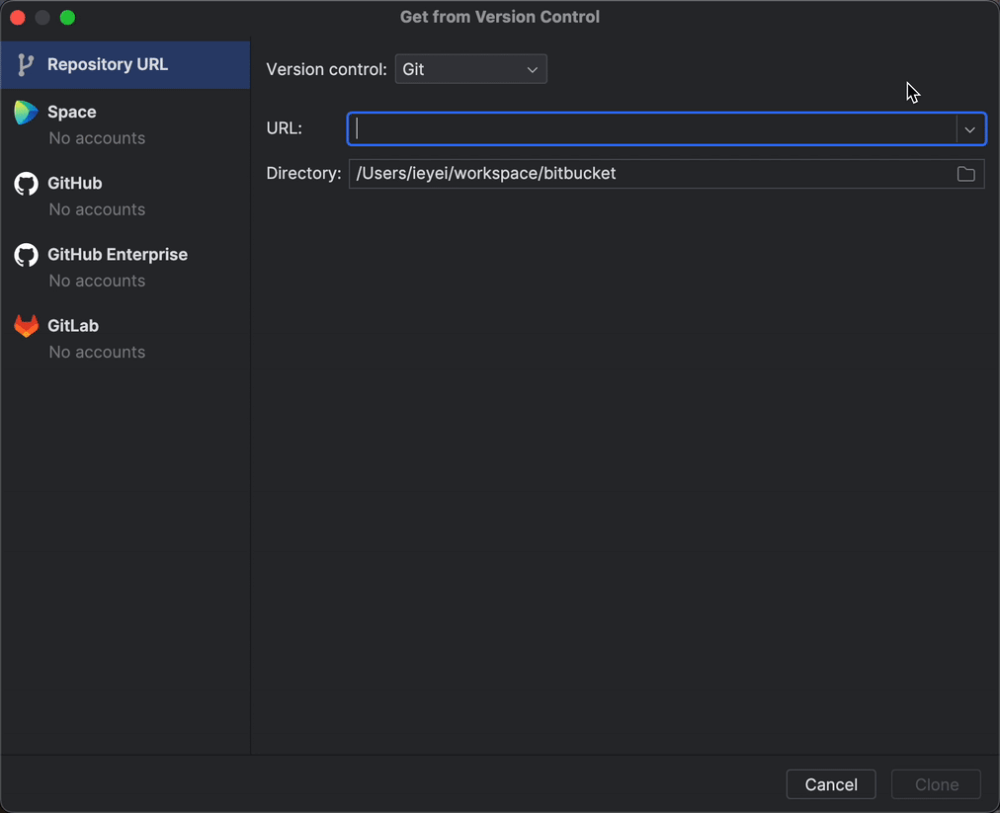

## Security

### Security Scan


[CNCF LANDSCAPE](https://landscape.cncf.io/)

Targets (what Trivy can scan):
* Container Image
* Filesystem
* Git Repository (remote)
* Virtual Machine Image
* Kubernetes
* AWS

Scanners (what Trivy can find there):
* OS packages and software dependencies in use (SBOM)
* Known vulnerabilities (CVEs)
* IaC issues and misconfigurations
* Sensitive information and secrets
* Software licenses

## trivy cli 실습
### Install from GitHub Release (Official)

```
curl -sfL https://raw.githubusercontent.com/aquasecurity/trivy/main/contrib/install.sh | sh -s -- -b $HOME/bin latest

```

trivy help 확인
```
trivy --help
```
```bash
Scanner for vulnerabilities in container images, file systems, and Git repositories, as well as for configuration issues and hard-coded secrets

Usage:
  trivy [global flags] command [flags] target
  trivy [command]

Examples:
  # Scan a container image
  $ trivy image python:3.4-alpine

  # Scan a container image from a tar archive
  $ trivy image --input ruby-3.1.tar

  # Scan local filesystem
  $ trivy fs .

  # Run in server mode
  $ trivy server

Scanning Commands
  aws         [EXPERIMENTAL] Scan AWS account
  config      Scan config files for misconfigurations
  filesystem  Scan local filesystem
  image       Scan a container image
  kubernetes  [EXPERIMENTAL] Scan kubernetes cluster
  repository  Scan a repository
  rootfs      Scan rootfs
  sbom        Scan SBOM for vulnerabilities
  vm          [EXPERIMENTAL] Scan a virtual machine image

Management Commands
  module      Manage modules
  plugin      Manage plugins

Utility Commands
  completion  Generate the autocompletion script for the specified shell
  convert     Convert Trivy JSON report into a different format
  help        Help about any command
  server      Server mode
  version     Print the version

Flags:
      --cache-dir string          cache directory (default "/Users/ieyei/Library/Caches/trivy")
  -c, --config string             config path (default "trivy.yaml")
  -d, --debug                     debug mode
  -f, --format string             version format (json)
      --generate-default-config   write the default config to trivy-default.yaml
  -h, --help                      help for trivy
      --insecure                  allow insecure server connections
  -q, --quiet                     suppress progress bar and log output
      --timeout duration          timeout (default 5m0s)
  -v, --version                   show version

```
:coffee:    **Record - Install trivy**


### Target - Container images
Container image 안 파일들 중 스캔 가능한 항목
* Vulnerabilities (enabled by default)
* Misconfigurations (disabled by default)
* Secrets (enabled by default)
* Licenses (disabled by default)

#### Vulnerabilities

```
trivy image python:3.4-alpine
```
**Severity**  

| Base Score Range | Severity |
|:----------------:| --- |
|     0.1-3.9      | Low |
|     4.0-6.9      | Medium |
|     7.0-8.9      | High |
|       9.0-10.0   | Critical |


특정 이미지(python:3.4-alpine)의 취약점 중 CRITICAL,HIGH 2가지만 조회하는 경우
```
trivy image --severity CRITICAL,HIGH python:3.4-alpine
```

<details>
<summary>Result</summary>

```bash
python:3.4-alpine (alpine 3.9.2)

Total: 17 (HIGH: 13, CRITICAL: 4)

┌──────────────┬────────────────┬──────────┬────────┬───────────────────┬───────────────┬─────────────────────────────────────────────────────────────┐
│   Library    │ Vulnerability  │ Severity │ Status │ Installed Version │ Fixed Version │                            Title                            │
├──────────────┼────────────────┼──────────┼────────┼───────────────────┼───────────────┼─────────────────────────────────────────────────────────────┤
│ expat        │ CVE-2018-20843 │ HIGH     │ fixed  │ 2.2.6-r0          │ 2.2.7-r0      │ expat: large number of colons in input makes parser consume │
│              │                │          │        │                   │               │ high amount...                                              │
│              │                │          │        │                   │               │ https://avd.aquasec.com/nvd/cve-2018-20843                  │
│              ├────────────────┤          │        │                   ├───────────────┼─────────────────────────────────────────────────────────────┤
│              │ CVE-2019-15903 │          │        │                   │ 2.2.7-r1      │ expat: heap-based buffer over-read via crafted XML input    │
│              │                │          │        │                   │               │ https://avd.aquasec.com/nvd/cve-2019-15903                  │
├──────────────┼────────────────┼──────────┤        ├───────────────────┼───────────────┼─────────────────────────────────────────────────────────────┤
│ libbz2       │ CVE-2019-12900 │ CRITICAL │        │ 1.0.6-r6          │ 1.0.6-r7      │ bzip2: out-of-bounds write in function BZ2_decompress       │
│              │                │          │        │                   │               │ https://avd.aquasec.com/nvd/cve-2019-12900                  │
├──────────────┼────────────────┼──────────┤        ├───────────────────┼───────────────┼─────────────────────────────────────────────────────────────┤
│ libcrypto1.1 │ CVE-2019-1543  │ HIGH     │        │ 1.1.1a-r1         │ 1.1.1b-r1     │ openssl: ChaCha20-Poly1305 with long nonces                 │
│              │                │          │        │                   │               │ https://avd.aquasec.com/nvd/cve-2019-1543                   │
│              ├────────────────┤          │        │                   ├───────────────┼─────────────────────────────────────────────────────────────┤
│              │ CVE-2020-1967  │          │        │                   │ 1.1.1g-r0     │ Segmentation fault in SSL_check_chain causes denial of      │
│              │                │          │        │                   │               │ service                                                     │
│              │                │          │        │                   │               │ https://avd.aquasec.com/nvd/cve-2020-1967                   │
│              ├────────────────┤          │        │                   ├───────────────┼─────────────────────────────────────────────────────────────┤
│              │ CVE-2021-23840 │          │        │                   │ 1.1.1j-r0     │ integer overflow in CipherUpdate                            │
│              │                │          │        │                   │               │ https://avd.aquasec.com/nvd/cve-2021-23840                  │
│              ├────────────────┤          │        │                   ├───────────────┼─────────────────────────────────────────────────────────────┤
│              │ CVE-2021-3450  │          │        │                   │ 1.1.1k-r0     │ openssl: CA certificate check bypass with                   │
│              │                │          │        │                   │               │ X509_V_FLAG_X509_STRICT                                     │
│              │                │          │        │                   │               │ https://avd.aquasec.com/nvd/cve-2021-3450                   │
├──────────────┼────────────────┤          │        │                   ├───────────────┼─────────────────────────────────────────────────────────────┤
│ libssl1.1    │ CVE-2019-1543  │          │        │                   │ 1.1.1b-r1     │ openssl: ChaCha20-Poly1305 with long nonces                 │
│              │                │          │        │                   │               │ https://avd.aquasec.com/nvd/cve-2019-1543                   │
│              ├────────────────┤          │        │                   ├───────────────┼─────────────────────────────────────────────────────────────┤
│              │ CVE-2020-1967  │          │        │                   │ 1.1.1g-r0     │ Segmentation fault in SSL_check_chain causes denial of      │
│              │                │          │        │                   │               │ service                                                     │
│              │                │          │        │                   │               │ https://avd.aquasec.com/nvd/cve-2020-1967                   │
│              ├────────────────┤          │        │                   ├───────────────┼─────────────────────────────────────────────────────────────┤
│              │ CVE-2021-23840 │          │        │                   │ 1.1.1j-r0     │ integer overflow in CipherUpdate                            │
│              │                │          │        │                   │               │ https://avd.aquasec.com/nvd/cve-2021-23840                  │
│              ├────────────────┤          │        │                   ├───────────────┼─────────────────────────────────────────────────────────────┤
│              │ CVE-2021-3450  │          │        │                   │ 1.1.1k-r0     │ openssl: CA certificate check bypass with                   │
│              │                │          │        │                   │               │ X509_V_FLAG_X509_STRICT                                     │
│              │                │          │        │                   │               │ https://avd.aquasec.com/nvd/cve-2021-3450                   │
├──────────────┼────────────────┼──────────┤        ├───────────────────┼───────────────┼─────────────────────────────────────────────────────────────┤
│ musl         │ CVE-2019-14697 │ CRITICAL │        │ 1.1.20-r4         │ 1.1.20-r5     │ musl libc through 1.1.23 has an x87 floating-point stack    │
│              │                │          │        │                   │               │ adjustment im ......                                        │
│              │                │          │        │                   │               │ https://avd.aquasec.com/nvd/cve-2019-14697                  │
├──────────────┤                │          │        │                   │               │                                                             │
│ musl-utils   │                │          │        │                   │               │                                                             │
│              │                │          │        │                   │               │                                                             │
│              │                │          │        │                   │               │                                                             │
├──────────────┼────────────────┤          │        ├───────────────────┼───────────────┼─────────────────────────────────────────────────────────────┤
│ sqlite-libs  │ CVE-2019-8457  │          │        │ 3.26.0-r3         │ 3.28.0-r0     │ heap out-of-bound read in function rtreenode()              │
│              │                │          │        │                   │               │ https://avd.aquasec.com/nvd/cve-2019-8457                   │
│              ├────────────────┼──────────┤        │                   ├───────────────┼─────────────────────────────────────────────────────────────┤
│              │ CVE-2019-19244 │ HIGH     │        │                   │ 3.28.0-r2     │ sqlite: allows a crash if a sub-select uses both DISTINCT   │
│              │                │          │        │                   │               │ and window...                                               │
│              │                │          │        │                   │               │ https://avd.aquasec.com/nvd/cve-2019-19244                  │
│              ├────────────────┤          │        │                   ├───────────────┼─────────────────────────────────────────────────────────────┤
│              │ CVE-2019-5018  │          │        │                   │ 3.28.0-r0     │ sqlite: Use-after-free in window function leading to remote │
│              │                │          │        │                   │               │ code execution                                              │
│              │                │          │        │                   │               │ https://avd.aquasec.com/nvd/cve-2019-5018                   │
│              ├────────────────┤          │        │                   ├───────────────┼─────────────────────────────────────────────────────────────┤
│              │ CVE-2020-11655 │          │        │                   │ 3.28.0-r3     │ sqlite: malformed window-function query leads to DoS        │
│              │                │          │        │                   │               │ https://avd.aquasec.com/nvd/cve-2020-11655                  │
└──────────────┴────────────────┴──────────┴────────┴───────────────────┴───────────────┴─────────────────────────────────────────────────────────────┘
2024-03-09T12:31:27.581+0900	INFO	Table result includes only package filenames. Use '--format json' option to get the full path to the package file.

Python (python-pkg)

Total: 3 (HIGH: 3, CRITICAL: 0)

┌───────────────────────┬────────────────┬──────────┬────────┬───────────────────┬───────────────┬───────────────────────────────────────────────────────────┐
│        Library        │ Vulnerability  │ Severity │ Status │ Installed Version │ Fixed Version │                           Title                           │
├───────────────────────┼────────────────┼──────────┼────────┼───────────────────┼───────────────┼───────────────────────────────────────────────────────────┤
│ pip (METADATA)        │ CVE-2019-20916 │ HIGH     │ fixed  │ 19.0.3            │ 19.2          │ python-pip: directory traversal in _download_http_url()   │
│                       │                │          │        │                   │               │ function in src/pip/_internal/download.py                 │
│                       │                │          │        │                   │               │ https://avd.aquasec.com/nvd/cve-2019-20916                │
├───────────────────────┼────────────────┤          │        ├───────────────────┼───────────────┼───────────────────────────────────────────────────────────┤
│ setuptools (METADATA) │ CVE-2022-40897 │          │        │ 40.8.0            │ 65.5.1        │ pypa-setuptools: Regular Expression Denial of Service     │
│                       │                │          │        │                   │               │ (ReDoS) in package_index.py                               │
│                       │                │          │        │                   │               │ https://avd.aquasec.com/nvd/cve-2022-40897                │
├───────────────────────┼────────────────┤          │        ├───────────────────┼───────────────┼───────────────────────────────────────────────────────────┤
│ wheel (METADATA)      │ CVE-2022-40898 │          │        │ 0.33.1            │ 0.38.1        │ remote attackers can cause denial of service via attacker │
│                       │                │          │        │                   │               │ controlled input to...                                    │
│                       │                │          │        │                   │               │ https://avd.aquasec.com/nvd/cve-2022-40898                │
└───────────────────────┴────────────────┴──────────┴────────┴───────────────────┴───────────────┴───────────────────────────────────────────────────────────┘
```
</details>

#### Misconfigurations
이미지 안에 Infrastructure as Code (IaC) 가 있다면 스캔 가능
```
trivy image --scanners misconfig [YOUR_IMAGE_NAME]
```

#### Secrets

```
$ trivy image [YOUR_IMAGE_NAME]
```
builtin-rules
```go
...
var (
	CategoryAWS                  = types.SecretRuleCategory("AWS")
	CategoryGitHub               = types.SecretRuleCategory("GitHub")
	CategoryGitLab               = types.SecretRuleCategory("GitLab")
	CategoryAsymmetricPrivateKey = types.SecretRuleCategory("AsymmetricPrivateKey")
	CategoryShopify              = types.SecretRuleCategory("Shopify")
	CategorySlack                = types.SecretRuleCategory("Slack")
	CategoryGoogle               = types.SecretRuleCategory("Google")
	CategoryStripe               = types.SecretRuleCategory("Stripe")
	CategoryPyPI                 = types.SecretRuleCategory("PyPI")
	CategoryHeroku               = types.SecretRuleCategory("Heroku")
	CategoryTwilio               = types.SecretRuleCategory("Twilio")
	CategoryAge                  = types.SecretRuleCategory("Age")
	CategoryFacebook             = types.SecretRuleCategory("Facebook")
	CategoryTwitter              = types.SecretRuleCategory("Twitter")
	CategoryAdobe                = types.SecretRuleCategory("Adobe")
	CategoryAlibaba              = types.SecretRuleCategory("Alibaba")
	CategoryAsana                = types.SecretRuleCategory("Asana")
	CategoryAtlassian            = types.SecretRuleCategory("Atlassian")
	CategoryBitbucket            = types.SecretRuleCategory("Bitbucket")
	CategoryBeamer               = types.SecretRuleCategory("Beamer")
	CategoryClojars              = types.SecretRuleCategory("Clojars")
	CategoryContentfulDelivery   = types.SecretRuleCategory("ContentfulDelivery")
	CategoryDatabricks           = types.SecretRuleCategory("Databricks")
	CategoryDiscord              = types.SecretRuleCategory("Discord")
	CategoryDoppler              = types.SecretRuleCategory("Doppler")
	CategoryDropbox              = types.SecretRuleCategory("Dropbox")
	CategoryDuffel               = types.SecretRuleCategory("Duffel")
	CategoryDynatrace            = types.SecretRuleCategory("Dynatrace")
	CategoryEasypost             = types.SecretRuleCategory("Easypost")
	CategoryFastly               = types.SecretRuleCategory("Fastly")
	CategoryFinicity             = types.SecretRuleCategory("Finicity")
	CategoryFlutterwave          = types.SecretRuleCategory("Flutterwave")
	CategoryFrameio              = types.SecretRuleCategory("Frameio")
	CategoryGoCardless           = types.SecretRuleCategory("GoCardless")
	CategoryGrafana              = types.SecretRuleCategory("Grafana")
	CategoryHashiCorp            = types.SecretRuleCategory("HashiCorp")
	CategoryHubSpot              = types.SecretRuleCategory("HubSpot")
	CategoryIntercom             = types.SecretRuleCategory("Intercom")
	CategoryIonic                = types.SecretRuleCategory("Ionic")
	CategoryJWT                  = types.SecretRuleCategory("JWT")
	CategoryLinear               = types.SecretRuleCategory("Linear")
	CategoryLob                  = types.SecretRuleCategory("Lob")
	CategoryMailchimp            = types.SecretRuleCategory("Mailchimp")
	CategoryMailgun              = types.SecretRuleCategory("Mailgun")
	CategoryMapbox               = types.SecretRuleCategory("Mapbox")
	CategoryMessageBird          = types.SecretRuleCategory("MessageBird")
	CategoryNewRelic             = types.SecretRuleCategory("NewRelic")
	CategoryNpm                  = types.SecretRuleCategory("Npm")
	CategoryPlanetscale          = types.SecretRuleCategory("Planetscale")
	CategoryPostman              = types.SecretRuleCategory("Postman")
	CategoryPulumi               = types.SecretRuleCategory("Pulumi")
	CategoryRubyGems             = types.SecretRuleCategory("RubyGems")
	CategorySendGrid             = types.SecretRuleCategory("SendGrid")
	CategorySendinblue           = types.SecretRuleCategory("Sendinblue")
	CategoryShippo               = types.SecretRuleCategory("Shippo")
	CategoryLinkedIn             = types.SecretRuleCategory("LinkedIn")
	CategoryTwitch               = types.SecretRuleCategory("Twitch")
	CategoryTypeform             = types.SecretRuleCategory("Typeform")
	CategoryDocker               = types.SecretRuleCategory("Docker")
	CategoryHuggingFace          = types.SecretRuleCategory("HuggingFace")
)
...
```
https://github.com/aquasecurity/trivy/blob/main/pkg/fanal/secret/builtin-rules.go


#### Licenses

```
trivy image --scanners license python:3.4-alpine
```
<details>
<summary>Result</summary>

```bash
OS Packages (license)

Total: 32 (UNKNOWN: 4, LOW: 15, MEDIUM: 2, HIGH: 11, CRITICAL: 0)

┌────────────────────────┬───────────────┬────────────────┬──────────┐
│        Package         │    License    │ Classification │ Severity │
├────────────────────────┼───────────────┼────────────────┼──────────┤
│ alpine-baselayout      │ GPL-2.0       │ Restricted     │ HIGH     │
├────────────────────────┼───────────────┼────────────────┼──────────┤
│ alpine-keys            │ MIT           │ Notice         │ LOW      │
├────────────────────────┼───────────────┼────────────────┼──────────┤
│ apk-tools              │ GPL-2.0       │ Restricted     │ HIGH     │
├────────────────────────┤               │                │          │
│ busybox                │               │                │          │
├────────────────────────┼───────────────┼────────────────┼──────────┤
│ ca-certificates        │ MPL-2.0       │ Reciprocal     │ MEDIUM   │
│                        ├───────────────┼────────────────┼──────────┤
│                        │ GPL-2.0       │ Restricted     │ HIGH     │
├────────────────────────┼───────────────┼────────────────┼──────────┤
│ ca-certificates-cacert │ MPL-2.0       │ Reciprocal     │ MEDIUM   │
│                        ├───────────────┼────────────────┼──────────┤
│                        │ GPL-2.0       │ Restricted     │ HIGH     │
├────────────────────────┼───────────────┼────────────────┼──────────┤
│ expat                  │ MIT           │ Notice         │ LOW      │
├────────────────────────┼───────────────┼────────────────┼──────────┤
│ gdbm                   │ GPL-3.0       │ Restricted     │ HIGH     │
├────────────────────────┼───────────────┼────────────────┼──────────┤
│ libbz2                 │ BSD-3-Clause  │ Notice         │ LOW      │
├────────────────────────┤               │                │          │
│ libc-utils             │               │                │          │
├────────────────────────┼───────────────┤                │          │
│ libcrypto1.1           │ OpenSSL       │                │          │
├────────────────────────┼───────────────┤                │          │
│ libffi                 │ MIT           │                │          │
├────────────────────────┼───────────────┼────────────────┼──────────┤
│ libressl2.7-libcrypto  │ custom        │ Non Standard   │ UNKNOWN  │
├────────────────────────┤               │                │          │
│ libressl2.7-libssl     │               │                │          │
├────────────────────────┼───────────────┼────────────────┼──────────┤
│ libssl1.1              │ OpenSSL       │ Notice         │ LOW      │
├────────────────────────┼───────────────┤                │          │
│ libtls-standalone      │ ISC           │                │          │
├────────────────────────┼───────────────┤                │          │
│ musl                   │ MIT           │                │          │
├────────────────────────┤               │                │          │
│ musl-utils             │               │                │          │
│                        ├───────────────┤                │          │
│                        │ BSD-3-Clause  │                │          │
│                        ├───────────────┼────────────────┼──────────┤
│                        │ GPL-2.0       │ Restricted     │ HIGH     │
├────────────────────────┼───────────────┼────────────────┼──────────┤
│ ncurses-libs           │ MIT           │ Notice         │ LOW      │
├────────────────────────┤               │                │          │
│ ncurses-terminfo       │               │                │          │
├────────────────────────┤               │                │          │
│ ncurses-terminfo-base  │               │                │          │
├────────────────────────┼───────────────┼────────────────┼──────────┤
│ readline               │ GPL-3.0       │ Restricted     │ HIGH     │
├────────────────────────┼───────────────┤                │          │
│ scanelf                │ GPL-2.0       │                │          │
├────────────────────────┼───────────────┼────────────────┼──────────┤
│ sqlite-libs            │ Public-Domain │ Non Standard   │ UNKNOWN  │
├────────────────────────┼───────────────┼────────────────┼──────────┤
│ ssl_client             │ GPL-2.0       │ Restricted     │ HIGH     │
├────────────────────────┤               │                │          │
│ xz-libs                │               │                │          │
│                        ├───────────────┼────────────────┼──────────┤
│                        │ Public-Domain │ Non Standard   │ UNKNOWN  │
├────────────────────────┼───────────────┼────────────────┼──────────┤
│ zlib                   │ Zlib          │ Notice         │ LOW      │
└────────────────────────┴───────────────┴────────────────┴──────────┘

Python (license)

Total: 3 (UNKNOWN: 1, LOW: 2, MEDIUM: 0, HIGH: 0, CRITICAL: 0)

┌────────────┬─────────┬────────────────┬──────────┐
│  Package   │ License │ Classification │ Severity │
├────────────┼─────────┼────────────────┼──────────┤
│ wheel      │ MIT     │ Notice         │ LOW      │
├────────────┤         │                │          │
│ pip        │         │                │          │
├────────────┼─────────┼────────────────┼──────────┤
│ setuptools │ UNKNOWN │ Non Standard   │ UNKNOWN  │
└────────────┴─────────┴────────────────┴──────────┘
```
</details>


:coffee:    **Record - Scan Image**



### Target - Filesystem
filesystem scan 을 위해서 git clone
```bash
cd ~/environment
git clone https://github.com/aquasecurity/trivy-ci-test.git
```

filesystem scan
```bash
trivy fs --severity CRITICAL ./trivy-ci-test
```
<details>
<summary>Result</summary>

```bash
Cargo.lock (cargo)

Total: 4 (CRITICAL: 4)

┌───────────┬────────────────┬──────────┬────────┬───────────────────┬───────────────┬─────────────────────────────────────────────────────────────┐
│  Library  │ Vulnerability  │ Severity │ Status │ Installed Version │ Fixed Version │                            Title                            │
├───────────┼────────────────┼──────────┼────────┼───────────────────┼───────────────┼─────────────────────────────────────────────────────────────┤
│ rand_core │ CVE-2020-25576 │ CRITICAL │ fixed  │ 0.4.0             │ 0.4.2, 0.3.1  │ An issue was discovered in the rand_core crate before 0.4.2 │
│           │                │          │        │                   │               │ for Rust....                                                │
│           │                │          │        │                   │               │ https://avd.aquasec.com/nvd/cve-2020-25576                  │
├───────────┼────────────────┤          │        ├───────────────────┼───────────────┼─────────────────────────────────────────────────────────────┤
│ smallvec  │ CVE-2019-15551 │          │        │ 0.6.9             │ 0.6.10        │ An issue was discovered in the smallvec crate before 0.6.10 │
│           │                │          │        │                   │               │ for Rust....                                                │
│           │                │          │        │                   │               │ https://avd.aquasec.com/nvd/cve-2019-15551                  │
│           ├────────────────┤          │        │                   │               ├─────────────────────────────────────────────────────────────┤
│           │ CVE-2019-15554 │          │        │                   │               │ An issue was discovered in the smallvec crate before 0.6.10 │
│           │                │          │        │                   │               │ for Rust....                                                │
│           │                │          │        │                   │               │ https://avd.aquasec.com/nvd/cve-2019-15554                  │
│           ├────────────────┤          │        │                   ├───────────────┼─────────────────────────────────────────────────────────────┤
│           │ CVE-2021-25900 │          │        │                   │ 0.6.14, 1.6.1 │ An issue was discovered in the smallvec crate before 0.6.14 │
│           │                │          │        │                   │               │ and 1.x...                                                  │
│           │                │          │        │                   │               │ https://avd.aquasec.com/nvd/cve-2021-25900                  │
└───────────┴────────────────┴──────────┴────────┴───────────────────┴───────────────┴─────────────────────────────────────────────────────────────┘

Pipfile.lock (pipenv)

Total: 4 (CRITICAL: 4)

┌─────────┬────────────────┬──────────┬────────┬───────────────────┬────────────────────────┬───────────────────────────────────────────────────────┐
│ Library │ Vulnerability  │ Severity │ Status │ Installed Version │     Fixed Version      │                         Title                         │
├─────────┼────────────────┼──────────┼────────┼───────────────────┼────────────────────────┼───────────────────────────────────────────────────────┤
│ django  │ CVE-2019-19844 │ CRITICAL │ fixed  │ 2.0.9             │ 1.11.27, 2.2.9, 3.0.1  │ Django: crafted email address allows account takeover │
│         │                │          │        │                   │                        │ https://avd.aquasec.com/nvd/cve-2019-19844            │
│         ├────────────────┤          │        │                   ├────────────────────────┼───────────────────────────────────────────────────────┤
│         │ CVE-2020-7471  │          │        │                   │ 1.11.28, 2.2.10, 3.0.3 │ potential SQL injection via StringAgg(delimiter)      │
│         │                │          │        │                   │                        │ https://avd.aquasec.com/nvd/cve-2020-7471             │
├─────────┼────────────────┤          │        ├───────────────────┼────────────────────────┼───────────────────────────────────────────────────────┤
│ pyyaml  │ CVE-2020-14343 │          │        │ 5.1               │ 5.4                    │ incomplete fix for CVE-2020-1747                      │
│         │                │          │        │                   │                        │ https://avd.aquasec.com/nvd/cve-2020-14343            │
│         ├────────────────┤          │        │                   ├────────────────────────┼───────────────────────────────────────────────────────┤
│         │ CVE-2020-1747  │          │        │                   │ 5.3.1                  │ PyYAML: arbitrary command execution through           │
│         │                │          │        │                   │                        │ python/object/new when FullLoader is used             │
│         │                │          │        │                   │                        │ https://avd.aquasec.com/nvd/cve-2020-1747             │
└─────────┴────────────────┴──────────┴────────┴───────────────────┴────────────────────────┴───────────────────────────────────────────────────────┘
```
</details>


:coffee:    **Record - Scan Filesystem**


### Target - Config
trivy 는 내부에 Docker, Kubernetes, Terraform, CloudFormation 등과 같은 코드 파일 스캔 가능  

Dockerfile 생성
```
cat <<EOF > Dockerfile
FROM node:18-alpine
WORKDIR /app
COPY . .
RUN yarn install --production
CMD ["node", "src/index.js"]
EXPOSE 3000
EOF
```

Dockerfile 스캔
```bash
trivy config Dockerfile
```
<details>
<summary>Result</summary>

```bash
Dockerfile (dockerfile)

Tests: 27 (SUCCESSES: 25, FAILURES: 2, EXCEPTIONS: 0)
Failures: 2 (UNKNOWN: 0, LOW: 1, MEDIUM: 0, HIGH: 1, CRITICAL: 0)

HIGH: Specify at least 1 USER command in Dockerfile with non-root user as argument
════════════════════════════════════════════════════════════════════════════════════════════════════════════════════════════════════════════════════════════════════════════════════════════════════════════
Running containers with 'root' user can lead to a container escape situation. It is a best practice to run containers as non-root users, which can be done by adding a 'USER' statement to the Dockerfile.

See https://avd.aquasec.com/misconfig/ds002
────────────────────────────────────────────────────────────────────────────────────────────────────────────────────────────────────────────────────────────────────────────────────────────────────────────


LOW: Add HEALTHCHECK instruction in your Dockerfile
════════════════════════════════════════════════════════════════════════════════════════════════════════════════════════════════════════════════════════════════════════════════════════════════════════════
You should add HEALTHCHECK instruction in your docker container images to perform the health check on running containers.

See https://avd.aquasec.com/misconfig/ds026
────────────────────────────────────────────────────────────────────────────────────────────────────────────────────────────────────────────────────────────────────────────────────────────────────────────

```
</details>


:coffee:    **Record - Scan Config**


## trivy intellij 실습
### source git clone
Intellij welcome 창 - `Get from VCS`


`git clone`  
git clone address
```bash
https://github.com/aquasecurity/trivy-ci-test.git
```


### Install trivy plugin
intellij 설정 창 오픈
- ⌘, (macOS) / Ctrl+Alt+S (Windows/Linux)

intellij 설정 창에서 plugins 검색 -> Plugins 에서 trivy 검색 -> Install 클릭 -> OK 클릭


### (windows 사용자) trivy binary 설치

Windows환경에서는 IntelliJ trivy플러그인을 통해 바이너리가 다운되지 않는 버그가 있다. 따라서 바이너리 파일을 직접 다운받아 설정한다.

https://github.com/aquasecurity/trivy/releases/tag/v0.52.2 이동, [trivy_0.52.2_windows-64bit.zip](https://github.com/aquasecurity/trivy/releases/download/v0.52.2/trivy_0.52.2_windows-64bit.zip) 다운로드, 압축해제

Trivy Findings plugin > Show settings 클릭
또는 IntelliJ 설정(shift 2번 연속 클릭) - path to Trivy  클릭



Path to Trivy 설정에서 다운로드 받은 trivy.exe 파일을 지정  



### Run trivy
Projects Open: intellij - File - Open - trivy-ci-test 디렉토리 선택  
좌측 윈도우에서 `Trivy Findings` Explorer 확인


trivy severity 설정 - Critical, High


Run Trivy


:coffee:    **Record - Trivy Intellij Lab**



**CI와의 통합 사례**

- **CI 파이프라인에 SonarLint 통합**: 
  자동화된 빌드 및 테스트 파이프라인에 SonarLint를 통합하여 코드 품질 검사를 자동화할 수 있다. 
  이를 통해 코드 리뷰 과정에서 발견되지 않은 이슈를 조기에 발견하고 해결할 수 있다.
- **SonarQube/SonarCloud와 연동**: 
  대규모 프로젝트의 경우, SonarLint와 함께 SonarQube 또는 SonarCloud를 사용하여 더 광범위한 코드 품질 관리를 수행한다. 
  CI 파이프라인을 통해 코드 변경 사항을 정기적으로 SonarQube/SonarCloud에 업로드하고, 상세한 코드 품질 보고서를 받을 수 있다.

**참조 프로세스**


[Next - GitHub Action](./github_action.md)
